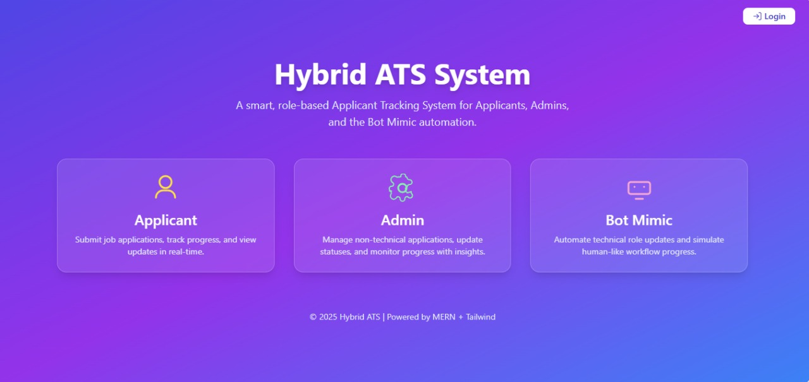
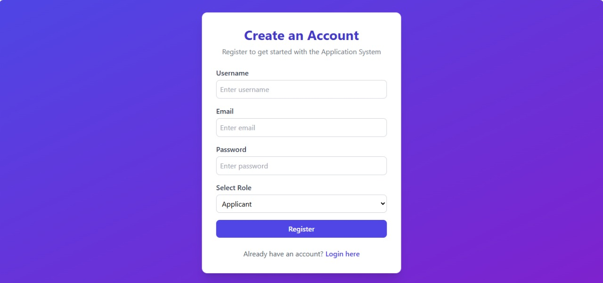
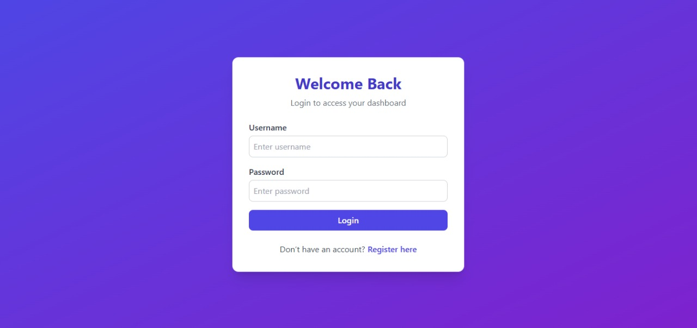
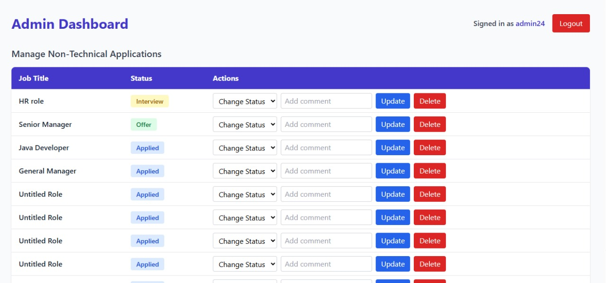
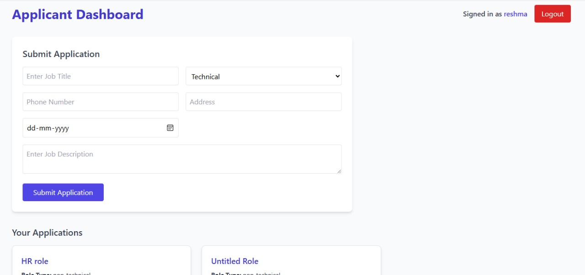

# 💼 Hybrid Application Tracking System (MERN)

## 🚀 Overview
This project is a **Hybrid Application Tracking System (ATS)** built using the **MERN Stack** (MongoDB, Express.js, React.js, Node.js), designed to handle both **manual (non-technical)** and **automated (technical)** job application processes.

It allows:
- 👩‍💼 **Applicants** to create and track their job applications.
- 🧑‍💻 **Admins** to manually manage and update **non-technical** role applications.
- 🤖 **Bot Mimic** to automatically update **technical** role applications (simulating an API-based workflow).

The system ensures **complete traceability** — every action or status change is logged with timestamps and role-based comments.

---

## 🛠️ Tech Stack
- **Frontend:** React.js, TailwindCSS, Recharts  
- **Backend:** Node.js, Express.js  
- **Database:** MongoDB Atlas  
- **Authentication:** JWT (JSON Web Token)  
- **Hosting:** Frontend – Vercel | Backend – Render  

---

### Features Implemented

✅ JWT-based authentication (Applicant / Admin / Bot)

✅ CRUD operations for job applications

✅ Manual and automatic status updates

✅ Application activity log (with timestamps & comments)

✅ Secure MongoDB Atlas connection

✅ Responsive UI built with TailwindCSS

✅ API integration using Axios

## 📁 Folder Structure

project/
├── backend/
│ ├── config/
│ │ └── db.js
│ ├── controllers/
│ │ ├── appController.js
│ │ ├── authController.js
│ │ ├── botMimicController.js
│ │ └── userController.js
│ ├── middleware/
│ │ ├── authMiddleware.js
│ │ ├── roleMiddleware.js
│ │ └── validateMiddleware.js
│ ├── models/
│ │ ├── activityLog.js
│ │ ├── Application.js
│ │ └── User.js
│ ├── routes/
│ │ ├── appRoutes.js
│ │ ├── authRoutes.js
│ │ ├── botRoutes.js
│ │ └── userRoutes.js
│ ├── scripts/
│ │ └── seedApplications.js
│ ├── .env
│ ├── package.json
│ └── server.js
│

└── frontend/
├── src/
│ ├── api/
│ │ └── axios.js
│ ├── components/
│ │ ├── Navbar.jsx
│ │ └── StatusCard.jsx
│ ├── context/
│ │ └── AuthContext.jsx
│ ├── pages/
│ │ ├── AdminDashboard.jsx
│ │ ├── ApplicantDashboard.jsx
│ │ ├── ApplicationForm.jsx
│ │ ├── BotDashboard.jsx
│ │ ├── Dashboard.jsx
│ │ ├── Home.jsx
│ │ ├── Login.jsx
│ │ └── Register.jsx
│ ├── utils/
│ │ └── api.js
│ ├── App.jsx
│ ├── main.jsx
│ ├── index.css
│ └── index.html
├── package.json
└── vite.config.js

## ⚙️ Setup Instructions

### Backend Setup

cd backend

cd backend

npm install

npm start

### Frontend Setup

cd frontend

npm run dev

## 🖼️ Application Screenshots (UI/UX)

The following screenshots illustrate the **Intuitive Dashboards** and clear **Role Separation**.

### 1. Home Page

### 2. User Registeration

This form allows new users to register as an Applicant to submit their interview applications.

### 3. User Login

This is the entry point where all three user types—Applicant, Bot Mimic, and Admin—can access their respective dashboards.

### 4. Admin Dashboard

The Admin manages manual status updates for non-technical roles and oversees all metrics.

### 5. Applicant Dashboard

The Applicant can track the **status, update history, and comments** for their submitted applications.

### 6. Bot Mimic Interface

This interface simulates automated updates for technical applications, generating **timestamped activity logs** marked "Bot Mimic".

